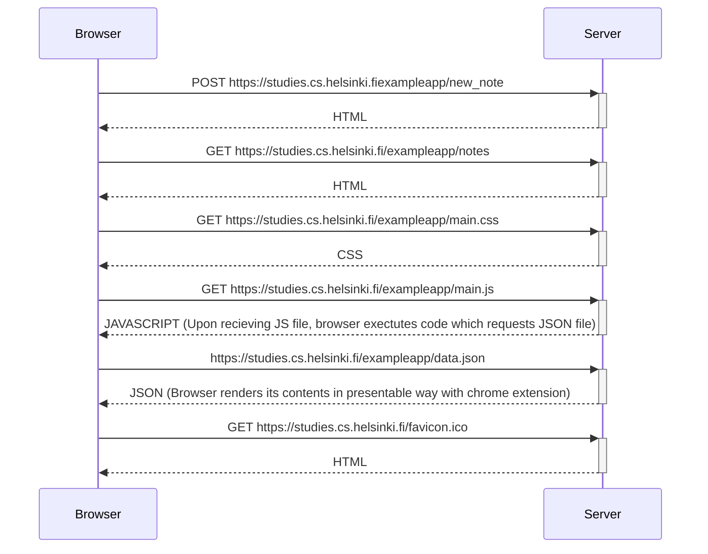

```mermaid
sequenceDiagram 

    Browser->>+Server: POST https://studies.cs.helsinki.fiexampleapp/new_note
    
    Server-->>-Browser:HTML
    

    Browser->>+Server: GET https://studies.cs.helsinki.fi/exampleapp/notes
    
    Server-->>-Browser:HTML    

    Browser->>+Server: GET https://studies.cs.helsinki.fi/exampleapp/main.css
    
    Server-->>-Browser: CSS    

    Browser->>+Server: GET https://studies.cs.helsinki.fi/exampleapp/main.js
    
    Server-->>-Browser: JAVASCRIPT (Upon recieving JS file, browser exectutes code which requests JSON file)
 

    Browser->>+Server: https://studies.cs.helsinki.fi/exampleapp/data.json
    
    Server-->>-Browser: JSON  (Browser renders its contents in presentable way with chrome extension)   


    Browser->>+Server: GET https://studies.cs.helsinki.fi/favicon.ico
    
    Server-->>-Browser: HTML     
```

